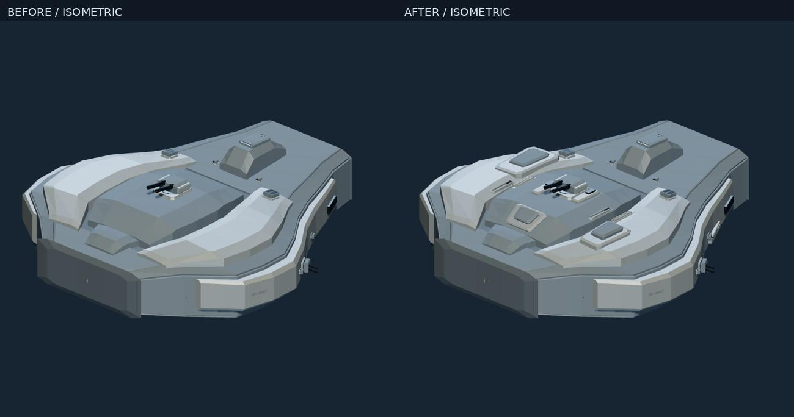
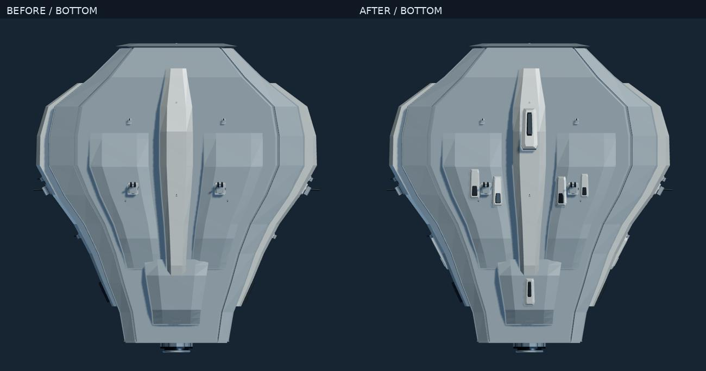
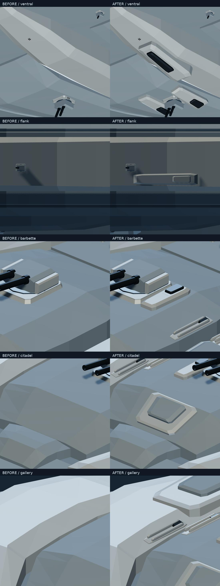

# V1.8.5.3 — Meso Geometry QA

Baseline: `5454dba41136622ca88b0e16916ac7c8ac786dee`, branch `work`. Captures and checks use an immutable copy of the staged release source, with the original local drafts excluded. Existing drafts and historical QA remain intact.

## Implementation and authority

Eight parametric structure kinds are implemented: ARMOR_STEP, ARMOR_SHOULDER_EXTENSION, WEAPON_BARBETTE_INTEGRATION, MACHINERY_GALLERY, ENGINE_ROOT_TRANSITION, FLANK_ARMOR_BELT, VENTRAL_KEEL_SUPPORT, SERVICE_RECESS_FRAME. The optional schema-2 `mesoStructurePlan` records functional zones, actual clipped parent station patches, thirteen attachment samples, closed solids, parameters, stable IDs, bounds, material/LOD roles and accepted/omitted decisions. These are visual structures; combat protection, strength and mass are not simulated or added to physical armor coverage.

Generation runs after the existing exterior kits and before material/surface planning. Macro, production armor/coverage, equipment, weapons, requirements and original kits remain byte-equivalent to explicit V1.8.5.2 generation after removing the intentional Meso/appearance/version additions. The separate RNG namespace leaves earlier stages unchanged. Saved historical JSON is replayed as stored; explicit `version: '1.8.5.2'` remains available.

See [the contract](../../docs/MESO_STRUCTURE.md) for functional zone rules, geometry, parent attachment, collision policy and style parameters.

## Tests and technical regression

- Entire suite: **689/689 tests, 24 files PASS**, including the original 677 and twelve Meso tests. Final release source was tested after the cannon-priority and functional-neighborhood corrections.
- TypeScript and production Vite build: **PASS**. The existing large viewer chunk warning remains; it is not a build failure.
- Original 222 controlled orders: **200 released / 22 rejected**, every decision identical to the baseline. See [controlled results](controlled-results.json).
- Final representative matrix: **28/28 released**, geometry/contact/safety and surface replay checks pass, repeat JSON deterministic, prior physical JSON unchanged, browser console errors zero. Covers eight architectures, six families, nine roles, four shipyards, 40/120/300/600m and Seeds 7/11/23/41. This is representative coverage, not an exhaustive Cartesian product. See [matrix results](matrix-release/report.json).
- Historical rendering: **13 stored/generated historical versions × five views** match baseline pixels and JSON-reloaded pixels exactly in the same Chromium/SwiftShader environment; console errors zero. See [history results](history-release/report.json). These are same-environment regression checks, not cross-GPU pixel guarantees.
- Seed 7 final complete renders: eight fixed-scale views and five matched close-up pairs; JSON reload reproduces pixels; all validation issues and console errors absent. See [render report](release-render/report.json).

## Actual visual review

Before/After uses identical camera, lighting and 360m orthographic extent for the 300m Aegis Cruiser Seed 7. Bottom/low-isometric use matched underbody inspection lighting. No bloom or exposure differences are used to suggest improvement.

Whole-ship review shows raised shoulder terraces, a narrower raised crest on the primary apron, measured support haunches next to the main cannon foundation, localized flank overlap and two ventral supports. Neutral clay and exterior-detail OFF retain the new geometry. The service frames have real separated rails and a low support sill, placed on an already open service-channel bank; they do not cut a new hole into a closed hull.

Seed 7 accepts **17 structures**: six cannon integrations (including both sides of the main L foundation), two shoulder extensions, one primary step, two flank covers, two ventral supports, three service frames and one machinery gallery. Main-cannon apron examples are approximately 10.8 × 30 × 2.92m; shoulder examples reach 28.8 × 45.6 × 6.9m. The existing weapons remain at their original size and pose.

The final 28-design matrix accepts 364 placements across seven kinds: cannon integration 86, flank 79, step 58, ventral 48, service frame 40, shoulder 27, gallery 26. **Engine-root transitions are implemented and solid-tested but none are accepted in this final representative matrix**: actual root surfaces are occupied/occluded by retained thermal equipment, local armor or kit access. Earlier exploratory captures had looser functional neighborhoods and are not final evidence. Do not claim final visual validation of the engine-root kind. A further eighteen real CORE_AND_NACELLES / ENGINE_DOMINANT patrol orders (Vesper/Forge/Serein, 120/300/600m, Seeds 0/13, mobility-focused low weapon budget) likewise yield zero accepted roots with no console errors; see [targeted root omissions](engine-root/summary.json). This is a remaining library placement limitation, not a reason to remove existing equipment or weaken contact tests.

## Style and broad comparisons

Aegis has broad, higher faceted tiers; Vesper has low narrow tapered covers; Forge uses clipped modular sections and mechanical contrast; Serein has low broad precise tiers. These are geometry parameters, not just palette changes. The existing primary hull remains the dominant authority, so the differences are restrained rather than four entirely new hull designs.

- [Four shipyards](review/shipyard-comparison.jpg)
- [Six families](review/family-comparison.jpg)
- [Eight architectures](review/architecture-comparison.jpg)
- [40–600m](review/length-comparison.jpg)
- [OFF / LOW / HIGH / AUTO](review/detail-modes.jpg)
- [TOP](review/before-after-TOP.jpg), [BOTTOM](review/before-after-BOTTOM.jpg), [LEFT](review/before-after-LEFT.jpg), [RIGHT](review/before-after-RIGHT.jpg), [FRONT](review/before-after-FRONT.jpg), [AFT](review/before-after-AFT.jpg), [ISOMETRIC](review/before-after-ISOMETRIC.jpg), [LOW ISOMETRIC](review/before-after-LOW-ISOMETRIC.jpg)

## Production UI and performance

Actual production bundle: **19 checks PASS, console errors zero**. Default generation, Seed regeneration, inspector, all debug modes, detail/finish switches without JSON mutation, real JSON export/import with pixel reproduction, saved reload, orbit/zoom/fit, mandatory XL, impossible-order rejection and historical imports pass. The 390px responsive layout is checked; a physical mobile GPU is not tested. See [UI report](ui/report.json).

Same Chromium/SwiftShader environment; ten alternating paired CPU samples after two warm-ups:

| Measurement | V1.8.5.2 | V1.8.5.3 |
|---|---:|---:|
| Generation median / p95 | 1058.4 / 1154.0ms | 1725.4 / 1760.9ms |
| Mesh construction median | 38.7ms | 41.3ms |
| HIGH inspection main calls / triangles | 22 / 18,034 | 25 / 20,620 |
| OFF inspection main calls / triangles | 14 / 11,386 | 17 / 13,972 |
| LOW or AUTO inspection calls / triangles | 18 / 16,694 | 21 / 19,280 |
| Shadow calls / triangles (1024 map scene) | 13 / 17,078 | 16 / 19,664 |
| Actual attribute/index bytes | 5,234,672 | 6,010,472 |
| Accounted shared texture bytes with mipmaps | 1,485,483 | 1,485,483 |
| Three-ship main calls / triangles | 68 / 53,878 | 77 / 61,636 |

Generation increases about 63%, principally actual support clipping, collision candidates and final safety replay. Standalone Meso planning median is 447.5ms, replay 135.6ms, total 577.7ms. No 25% CPU-growth guarantee is claimed: this version prioritizes visible geometry and real-time batching. The dedicated performance scene has one additional helper/light-related draw versus the inspection renderer (23→26 calls). All three ships share eight shader programs; no per-structure program is introduced.

Five repeated JSON mesh reloads retain stable geometry/texture counts. Ship disposal leaves zero geometries and one renderer-owned shadow texture; appearance asset ownership returns to its initial counts. This is a bounded allocation/count regression check, not proof of all driver memory behavior.

`EXT_disjoint_timer_query_webgl2` is available in this **software** SwiftShader run: sampled main-pass queries are 124.70ms before, 135.84ms after, 202.53ms in another warm after run. These do not benchmark a hardware GPU. Main/shadow readback wall times, cold shader compilation and first-frame values are retained in [the raw compact report](performance/report.json). First compile varies from 23.8ms baseline to 2341.9ms new and 17.5ms warm-new, demonstrating driver cache/order effects; these are not a fair isolated compile-speed comparison. Exact GPU resident memory, physical GPU frame time and mobile GPU performance are **unmeasured**. Buffer/texture byte counts describe uploaded asset payloads, not total GPU allocation.

## Problems found and corrected

1. A flat bottom chord of a cover intersected tapered parent geometry. The serialized root now clips real station triangles; its bottom follows that support patch with a small measured inset.
2. Roof placement considered only edge contact samples. It now uses all clipped root vertices, closing curved/tapered support safely.
3. Early optional armor occupied the major cannon integration neighborhood. Main L cannon zones now precede optional terraces.
4. Weapon and service additions could move too far along a parent hull during retries. Weapon retries use the actual local mount axis/footprint; channel retries remain inside the actual usable channel; engine retries remain near the upstream root. Validator independently rechecks source neighborhoods.
5. Sparse containment alone missed thin obstacles. Edge/triangle crossings supplement broad-phase, containment, equipment envelopes and static firing/access rays.
6. Optional failures could invalidate otherwise valid appearances. Final replay safely omits only failing optional structures; physical requirements and release decisions remain intact.

## Limits and incomplete visual targets

The whole-ship difference is visible, but broad fore/aft armor remains plain and the underlying macro shapes remain simple. Sparse/open layouts (especially the sampled HYBRID with only two placements) show less improvement. Side profile changes are localized rather than a complete redesign. The result is not claimed to reach the reference artwork's integrated mechanical complexity. Engine-root transitions still lack an accepted final representative example.

Checks are conservative mixed broad-phase, containment, edge/triangle and sample-based tests, not complete CSG or exhaustive coplanar intersection, continuous turret motion, every firing direction or simulated crew paths. Zone `availableAreaM2` is a facing-triangle candidate estimate before occlusion, not exact free surface union; accepted attachment is separately measured. Existing closed hulls are not excavated. No arbitrary combat protection or physical mass is added. LOD classes are preparation metadata, not a completed full-ship LOD compiler.

Raw PNGs, JSON authority files and interim captures remain local; compact review sheets and reproducible scripts are committed. The original dirty user drafts remain in the shared working directory and are excluded from this commit.
